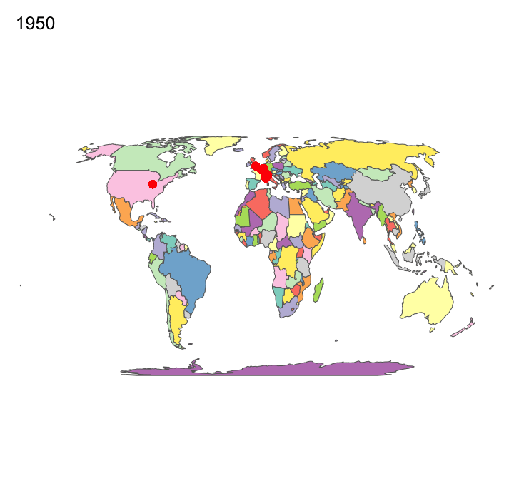

```{r setup, include=FALSE}
library(flexdashboard)
```

A Brief Introduction into Formula 1 {data-icon="fa-picture-o"}
===================================== 
### Most Successful Teams in Formula 1 History

```{r, fig.align='center', message = FALSE, warning = FALSE, echo = F, results = T}
knitr::include_graphics('total_constructor_champion.png') # out.width='25%', 
```


### Most Successful Drivers in Formula 1 History
```{r, fig.align='center', message = FALSE, warning = FALSE, echo = F, results = T}
 # out.width='25%', 
```

Formula 1 Circuits {data-icon="fa-map-marker"}
===================================== 
### Formula 1 Circuits
```{r, fig.align='center', message = FALSE, warning = FALSE, echo = F, results = T}
 # out.width='25%', 
```


Pre-season testing {data-icon="fa-car"}
===================================== 
### Pre-season testing

```{r, out.width='100%', fig.align='center', , message = FALSE, warning = FALSE, echo = F, results = T}
knitr::include_graphics("pre-season_testing_laptime.png")
```

Sentiment Analysis {data-icon="fa-smile-o"}
===================================== 
### Sentiment Analysis

```{r, fig.align='center', message = FALSE, warning = FALSE, echo = F, results = T}
htmltools::includeHTML("driver_radar_chart.html")
```

Drivers & Teams {data-icon="fa-info"}
===================================== 
### Drivers & Teams
```{r, fig.height = 10, fig.align='center', message = FALSE, warning = FALSE, echo = F, results = T}
htmltools::includeHTML("drivers_teams_network.html")
```


