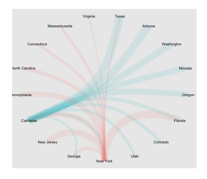

# Network Graph Assignment

## Introduction

In this assignment you will visualize the flow of people between different states in the United States over the period of one year, using network graphs. 

You are required to choose New York, Texas and two other states as the origin states (where people lived the previous year) for this visualization, and show graphically the relative numbers of people that moved to the top 10  destination states (current state, in the data set) from each of the origin states. You are expected to create a **single graphic** for this project. For clarity, for each origin state, you will find the top 10 states that people moved to from that state in the year in question, and the *union* of those states will be represented as nodes in the graph. You will not consider migrations to other countries or US Territories (Puerto Rico, Guam and others), but only consider migrations to the 50 states and District of Columbia.

## Data

The `data` folder contains 1 file

1. The file [`State_to_State_Migrations_Table_2018.xls`](data/State_to_State_Migrations_Table_2018.xls) contains a single sheet with all the relevant data from the American Community Survey for the year 2018. This file is exactly as can be downloaded from [here](https://www.census.gov/data/tables/time-series/demo/geographic-mobility/state-to-state-migration.html), just as the US Census provides it to the public.

## Tasks

1. You have to extract the data from this Excel file programmatically, i.e., using R and/or Python, not just copy it by hand to another Excel file. For this, you will have to open and understand the structure and format of the data in the file. 
1. You will need to extract the data in the form of a data frame with 3 columns: `source`, `target` and `count`; the last column will contain the numbers of people who migrated from the `source` state to the `target` state in 2018
1. You can now use this data frame to create a graph object using `igraph` (R or Python), `tidygraph` (R) or `networkx` (Python)
1. You will create a single network graph, where the width of each edge representing the number of people moving between the two states, the color of the edge denoting the state of origin, and preferably arrows denoting the direction of migration. These aspects are required. You can style other aspects of the graph as you choose to improve readability.
1. Your submission will consist of one R Markdown file, named `networks.Rmd` and its corresponding HTML file `networks.html`, along with any files and folders created in the rendering process. 

### Submitting the Assignment

Make sure you commit and push to GitHub **only the files requested above**! Although you can upload files to GitHub using the website, we would prefer if you get in the habit of cloning your repisitory to your local  machine, and using git to push back to GitHub using commit messages.

## Example

This is an example. You're free to choose this style of network graph, or any other type of network graph  you like.

## Helpful tips

1. Do open the Excel file first to understand its structure before you start trying to extract the data; run-of-the-mill methods won't work very well. The data extraction and munging from the Excel file is non-trivial and can be confusing. In R, the packages **tidyxl** and **unpivotr** make it much much easier. Some methods using these packages are available in this [blog post](https://webbedfeet.netlify.app/post/tidying-messy-excel-data-tidyxl/#)
2. The resources for `ggraph`, `igraph` and `networkx` on the web are excellent. Please use them.
3. There are excellent examples for formatting graphs in `igraph` and `ggraph` in the Time Series and Text Visualization lecture from Week 10.

## Use excellent (not just good) design practices

You must use excellent design practices and make choices that support them for a clean and professional presentation. Think about the first three weeks of the course and  use the frameworks we discussed as guidelines for making great visualizations for your audience.

As a reminder, an effective visualization should not require audience to try and figure out what is being shown. All information must be presented clearly using using multiple techniques. All charts **must** have the following:

* Legends and/or commentary that explain the encodings, with properly formatted titles, and proper spelling and grammar
* Properly formatted descriptive chart titles and axis titles. For example, display `Millions of units` instead of `million_of_units` 
* Properly formatted axis labels:
    - No scientific notation (`0e+00`, `2e+04`, etc.) unless explicity formatted given your values 
    - Units
    - Commas for separating orders of magnitude (`1,000,000` for one million, etc)
* Variable names and encodings must be descriptive
* Faceting when appropriate and relevant

Remember, deafault settings are not usually the best. Make your visualization **both beautiful and useful**. 

**YOUR WORK MUST BE PUBLICATION READY!**

## Grading Criteria

The assignment will be graded holistically considering the following (in no particular order of importance):

+ The work is complete
+ The visualizations answer questions and tell a story
+ The visualization choices are justified and are designed for the right audience
+ All visualizations are labeled properly and correctly with titles, axes and legends
+ All output is correct and the code runs and does what it is expected to do
+ There is discussion on specifics of the analysis, and analysis decisions are justified
+ [The](https://rmarkdown.rstudio.com/flexdashboard/examples.html) deliverable is professional and properly formatted, has clean  presentation, reasonable design choices, and no spelling/grammatical errors

You will receive full credit if your submission meets all of the  above criteria. If not, you will receive partial credit where  applicable. However, points **will** be deducted for **any** of the following reasons (in no particular order of importance):

+ You perform the visualizations and analysis just for the sake of doing them, without thinking through and providing analytical justification
+ The instructions are not followed
+ There are missing sections of the assignment
+ The visualizations are sloppy
+ The visualizations are not labeled or titled properly
+ There is no legend or information to provide context
+ The reader has to try to decipher what is being conveyed in the visualization
+ The overall presentation and/or writing is sloppy
+ There are no comments in your code
+ There are files in the repository other than those requested
+ There are absolute filename links in your code
+ The repository structure is altered in any way
+ Files are named incorrectly

and last, but not least

+ You use Excel for your charts
+ You create a pie chart with 100 categories
+ Your visuals look like those we've seen created by Fox News
