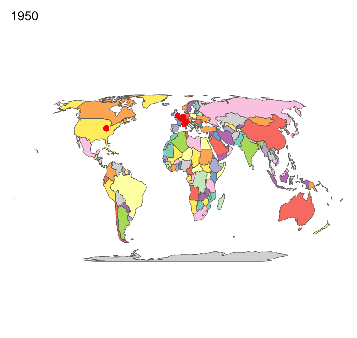

```{r setup, message = FALSE, warning = FALSE, include=FALSE}
knitr::opts_chunk$set(echo = TRUE)
library(tidyverse)
library(janitor)
library(readxl)
library(tmap)
#library(sp)
# library(leaflet)
library(sf)
library("gifski")
# library(igraph)
```

## **Visualizations**

### Geographical graph: Formula 1 circuits around the world
```{r f1 circuit map, message = FALSE, warning = FALSE, echo = F, results = F}
f1 <- read_excel("data/All F1 Races.xlsx")
f1 %>% glimpse()

# combine geo coordinates f1_circuits_coordinates.csv with f1
f1_circuit_geo <- read_csv("data/f1_circuits_coordinates.csv")

f1 <- f1 %>% 
  left_join(f1_circuit_geo[, c("Latitude", "Longitude", "circuitId")], by = "circuitId")


f1_circuit_sf <- st_as_sf(f1[!is.na(f1$Latitude),], coords=c("Longitude", "Latitude"), crs = 4326) # 4326 27700
f1_circuit_sf %>% glimpse()

data("World")
tmap_mode("view")
# f1_circuit_map <- tm_shape(World) +
#   tm_style("col_blind") +
#   tm_polygons(style = "pretty", col = "MAP_COLORS") + # col = "MAP_COLORS"
#   tm_compass(position = c("left", "bottom"))+
#   tm_scale_bar(position = c("left", "bottom"))+
#   tm_shape(f1_circuit_sf) +
#   tm_dots(size = 0.5, col = "red", labels = 'circuitName')+#, id = "label", # bold in popup
#           #popup.vars = c("season", "circuitName")) +  #tm_dots + # light in popup) +palette = "BuGn"
#   tm_layout(main.title = "F1 circuits in the world from 1950-2019", bg.color = "white", frame = FALSE, title.position= c("right", "top")) +
#   tm_facets(along = 'season', free.coords = F)
#   # tm_text(text = "circuitName", size = 1, auto.placement=T) # remove.overlap = TRUE

f1_circuit_map = tm_shape(World) + tm_polygons(col = "MAP_COLORS") + 
  tm_shape(f1_circuit_sf) + tm_dots(size = 0.5, col = "red", labels = 'circuitName') +
  tm_layout(bg.color = "white", frame = FALSE)+
  tm_facets(along = "season", free.coords = FALSE)

tmap_animation(f1_circuit_map, filename = 'f1_circuit_map.gif', delay=100, restart.delay = 200)

# top 10 most raced circuits by F1
top_10_circuits <- f1 %>% group_by(circuitName) %>%
  summarise(Count_Circuits = n()) %>%
  arrange(desc(Count_Circuits)) %>%
  head(10)
```
```{r, message = FALSE, warning = FALSE, echo = F, results = T}
print("Top 10 raced circuits:")
print(top_10_circuits)
```



From this F1 circuit map, we can see that over the 70 years of F1, it started regionally with most of races in Europe and 1 race in North America, and gradually made its way to Africa, to Southeast Asia, South America, Australia, then finally to East Asia. Nowadays it has races in all of the continents except Antarctica of course. F1 normally has 19-23 races per year, which means the teams and drivers travel to as many as 23 countries per year and race in front of millions of fans in those 23 countries. Compared to other global sports such as NBA (races are held mainly in the US), FIFA World Cup (races happen every four years), Olympics (races happen every four years), in terms of global exposure and fans coverage, I think it is safe to say F1 is the most global sports in the world. However, most of F1 races are still held in Europe, which is why it is hard to label all the circuits in the map, so I chose to use red dots instead of the circuit names to show the trend over the 70 years.  


### Exploratory graph: a brief introduction into Formula 1
```{r Exploratory graph 1, fig.align='left', message = FALSE, warning = FALSE, echo = F, results = T}
f1 <- f1 %>%
  mutate_at('season', as.integer) %>%
  mutate_at('points', as.numeric)

# choose teams who've won the constructor championship in each season
# constructors' champion wasn't a thing until 1958
constructors_champions_each_season <- f1 %>%
  filter(season >= 1958) %>%
  group_by(season, name) %>%
  summarise(total_points=sum(as.numeric(points))) %>%
  slice_max(total_points) %>%
  group_by(name) %>%
  summarise(total_constructors_champions=n())

# for teams who've won the constructor championship
# calculate the total_points earned by each team
constructors_champions_total_point <- 
  f1 %>%
  group_by(name) %>%
  summarise(total_points = sum(points)) %>%
  right_join(constructors_champions_each_season, by = 'name') %>%
  arrange(desc(total_constructors_champions))

# plot the number of championships each team won into a bar chart
# and overlays it with a line chart of total points
ggplot(constructors_champions_total_point, aes(x = factor(name, level = c('Ferrari','McLaren','Williams','Mercedes','Red Bull','BRM','Brabham-Repco','Cooper-Climax', 'Renault','Tyrrell', 'Benetton','Brawn','Lotus-Climax','Lotus-Ford', 'Matra-Ford','Team Lotus' )))) + 
  geom_bar(aes(y = total_constructors_champions), stat="identity",size = 1, fill=c("#9B0000", "#FF8700", "#0082FA", "#00D2BE", "#1E41FF", "#004225", "#0f361e", "#006635", "#FFF500", "#145bb7", "#118ece", "#FAFF41", "#0d4926", "#18251d", "#0b6cba", "#FFB800")) + # these are hex code for each team
  geom_line(aes(y = total_points/500), stat="identity",size = 0.5, color="black", group = 1) + #the second axis is originally the same as the main axis, /400 then *400 to make the second axis work
  geom_text(aes(label=total_constructors_champions, x=name, y=total_constructors_champions), colour="black")+ 
  # geom_text(aes(label=total_points, x=name, y=total_points), colour="red")+ 
  scale_y_continuous(limits = c(0,20), sec.axis = sec_axis(~.*500, name = "Total points")) +
  labs(x="Constructors that have won >= 1 championship", y="Total constructors champions", title='Total championships and total points each constructor won from 1958-2019') +
  theme_bw() +
  theme(axis.text.x = element_text(color = "grey20", size = 14),
        axis.text.y = element_text(color = "grey20", size = 16),  
        axis.title.x = element_text(color = "black", size = 20),
        axis.title.y = element_text(color = "black", size = 20),
        plot.title = element_text(color = "black", size = 26),
        plot.margin = unit(c(0, 0, 0, 0), "cm"))

# save the graph to a picture
ggsave("total_constructor_champion.png", width=16, height=8, dpi=300)
```

In Formula 1, there are two types of championships. One is the constructors' championship, which was first awarded for F1 Manufacturers in 1958. Each team has 2 drivers and each driver gets some points depending on where he finishes in the race, and the points drivers earn will be points added to both the constructors' championship and drivers' championship. After around 20 races per year, the team that earn most points from both drivers is the world constructors' champion and the driver that earn most points is the world drivers' champion.  
  
There are a total of 208 teams that competed in Formula 1, and only 16 of them have won one or more constructors' championship, so less then 10% shows the level of difficulty of being number 1 out of all teams. As we can see from the graph indicated by the bars, being the team that have won 17 constructors championships before, Ferrari is definitely one of the most successful F1 team in the field. The line chart shows the total points earned by each team from all the races they've raced in, not only the races in the year(s) they won the constructors' championship, some teams raced in fewer years but won more championships so they may have fewer points than teams with fewer constructors' championship.  
  
You may wonder why I used similar colors for some teams, the colors are actually the team color. Each team has its own unique color and I went through a lot of pictures to get them, and indeed many teams use similar colors.


```{r Exploratory graph 2, message = FALSE, warning = FALSE, echo = F, results = T}
drivers_championship_data <- read.csv("data/drivers_championship_1950-2020.csv", colClasses=c("NULL",NA,NA,NA,NA,NA,NA,NA)) # "NULL" (note the quotes!) means skip the column, NA means that R chooses the appropriate data type for that column.
drivers_championship <- drivers_championship_data %>%
  filter(Position == 1) %>%
  group_by(Name) %>%
  summarise(Total_Drivers_Championship = n())

drivers_championship_total_points <- drivers_championship_data %>%
  group_by(Name) %>%
  summarise(Total_Points = sum(Points))

# below shows drivers that have won >= 1 championship
# and their total points earned
drivers_championship <- drivers_championship %>%
  left_join(drivers_championship_total_points, by='Name')

# plot the number of championships each driver won into a bar chart
# and overlays it with a line chart of total points
ggplot(drivers_championship, aes(x = Name)) + 
  geom_bar(aes(y = Total_Drivers_Championship), stat="identity",size = 1, fill = "lightblue") + 
  geom_line(aes(y = Total_Points/500), stat="identity",size = 1, color="orange", group = 1) + #the second axis is originally the same as the main axis, /400 then *400 to make the second axis work
  geom_text(aes(label=Total_Drivers_Championship, x=Name, y=Total_Drivers_Championship), colour="black", size = 12)+ 
  # geom_text(aes(label=total_points, x=name, y=total_points), colour="red")+ 
  scale_y_continuous(limits = c(0,8), sec.axis = sec_axis(~.*500, name = "Total points")) +
  labs(x="Drivers that have won >= 1 championship", y="Total drivers championship", title='Total championships and total points each driver won from 1950-2019') +
  theme_bw() +
  theme(axis.text.x = element_text(color = "grey20", size = 14),
        axis.text.y = element_text(color = "grey20", size = 16),  
        axis.title.x = element_text(color = "black", size = 20),
        axis.title.y = element_text(color = "black", size = 20),
        plot.title = element_text(color = "black", size = 26),
        plot.margin = unit(c(0, 0, 0, 0), "cm")) #top, right, bottom, left)
  # coord_flip()
# save the graph to a picture
ggsave("total_driver_champion.png", width=40, height=8, dpi=300)
?theme
```

Similar to the constructors championship, only the selected few have ever won a driver's championship during their years in Formula 1. The driver's championship started earlier than the constructors' championship in 1950. Out of all the drivers, Lewis Hamilton and Michael Schumacher are the most successful ones, each winning 7 titles. Lewis Hamilton just won his 7th title this year and in his peak (which is scary to think about considering he's been in this sport for more than 13 years and already won 7 titles) so it's very likely that he will beat Michael's record next year. Due to Hamilton's dominance over the years, only 2 drivers' that have won the driver's championship other than Hamilton are still active on the field, which is very rare considering in the 1950's there were usually more than 5 driver's champions in the field. 


### Network graph: drivers & teams
```{r drivers & teams, message = FALSE, warning = FALSE, echo = F, results = T}
# 2 network graphs:
# 1. drivers, team and number of seasons a driver stays at the team

num_seasons <- f1 %>%
  select(season, name, `Full Name`) %>%
  unique() %>%
  group_by(`Full Name`, name) %>%
  summarise(Num_Seasons = n()) %>%
  rename('driver' = `Full Name`, 'team' = name)


drivers_championship

tot_points_w_team <- f1 %>%
  select(season, points, name, `Full Name`) %>%
  # unique() %>%
  group_by(`Full Name`, name) %>%
  summarise(tot_points = sum(points)) %>%
  rename('driver' = `Full Name`, 'team' = name)

drivers_teams <- num_seasons %>%
  # left_join(tot_points_w_team, by = c('driver', 'team')) %>%
  inner_join(drivers_championship[,1], by = c("driver" = "Name"))

library(networkD3)

# create nodes data by determining all unique nodes found in my df
node_names <- unique(c(as.character(drivers_teams$driver), as.character(drivers_teams$team)))
nodes <- data.frame(name = node_names)
# nodes1 <- unique(pivot_longer(drivers_teams[,1:2], driver:team)) %>% rename(group = name, name = value)
# create links data by matching the source and target values to the index of the
# node it refers to in the nodes data frame
links <- data.frame(source = match(drivers_teams$driver, node_names) - 1,
                    target = match(drivers_teams$team, node_names) - 1,
                    Before_value = drivers_teams$Num_Seasons)

network_graph <- sankeyNetwork(Links = links, Nodes = nodes, Source = "source", 
              Target = "target", Value = "Before_value", NodeID = "name", 
              units = "season(s)", fontSize = 11, nodeWidth = 30, height = 800, width = 600, 
              margin = NULL, NodeGroup = "name")

# add a title to the graph
network_graph <- htmlwidgets::prependContent(network_graph, htmltools::tags$h1("Number of seasons a world champion stays at a team"))
# sankey <- htmlwidgets::appendContent(sankey, htmltools::tags$p("Caption"))
network_graph

# save the widget
library(htmlwidgets)
saveWidget(network_graph, file="drivers_teams_network.html", title = "Number of seasons a driver stays at a team")
```
Above network graph shows the number of seasons a driver stays at a team. It's an interactive graph so you can click on to see the exact number of seasons and connections between drivers and teams. On the left is all the F1 drivers that have raced for at least one team, and on the right is all the F1 teams that have raced in a season. The longer the driver's/team's bar is, the longer the driver/team has been with F1. The link between drivers and teams indicates a driver has raced for a team before. The thicker the link is, the more seasons that this driver has raced for this team. Obviously the longer a team has raced in F1, the more links and more drivers it has. Let's take Williams for an example. As one of the teams that has been in F1 for the longest period of time, it has 56 drivers throughout its 44 years in F1. There is also a connection between the success of a driver and its longevity and number of teams he stayed at F1. Successful drivers can stay in F1 longer and can move among teams because of his performance. And you can see some less successful drivers with only one or two links to a team at the very bottom. Another observation is that a driver tends to stay at a team if he performs well, until he doesn't, and he joins another team. For example Alain Prost, a four-time world champion, stayed at McLaren for 7 seasons, which he won 3 titles with. He joined Ferrari after McLaren for 2 seasons, but it was a disaster, so he quickly moved onto Williams, where he won his 4th and last title.

### Timeseries graph: 2020 Barcelona Pre-Season Testing Timelapse
```{r time series, fig.height = 20, message = FALSE, warning = FALSE, echo = F, results = T}
test <- read_excel("data/2020_F1_pre-season_testtiming_data_v3.xl.xlsx", sheet = 'All_Data', col_names = TRUE, na = "")

# test$img <- NULL
# test <- test %>%
#   mutate(img = ifelse(driver=='RAI', "alfaromeo.png", 
#               ifelse(driver=="KVY", "alphatauri.png", 
#               ifelse(driver=="LEC", "ferrari.png", 
#               ifelse(driver=="MAG", "haas.png", 
#               ifelse(driver=="SAI", "mclaren.png", 
#               ifelse(driver=="BOT", "mercedes.png", 
#               ifelse(driver=="PER", "racingpoint.png", 
#               ifelse(driver=="VER", "redbull.png", 
#               ifelse(driver=="OCO", "renault.png", 
#               ifelse(driver=="RUS", "williams.png", 0)))))))))))

# library(jpeg)
# library(grid)
# library(ggimage)
# img <- readJPEG("f1_tyres.jpeg")
# g <- rasterGrob(img, width=unit(1,"npc"), height=unit(1,"npc"), interpolate = FALSE)

test <- test %>% 
  filter(math != 'partial' & `Date+time` > as.POSIXct('2020-02-28 14:00:00', tz="UTC")) %>%
  select(`Date+time`, driver, lapsecs, tyre)
ts <- ggplot(test, aes(x = `Date+time`, y = lapsecs, group = driver)) +
  # geom_image(aes(x = `Date+time`, y = lapsecs, image = img)) + # add images to replace boring points but sizes were distorted https://buzzrbeeline.blog/2018/06/13/fun-and-easy-r-graphs-with-images/
  geom_line(aes(color = tyre),size = 1) +
  scale_color_manual(labels = c("Hard", "Medium", "Soft", "Ultrasoft"), values=c("grey", "yellow", "red", "purple")) +  # manually edit the text & color of legends to make more sense to readers
  theme_minimal() +
  scale_y_continuous(limit = c(75, 165), minor_breaks = seq(75 , 175, 5), breaks = seq(75, 175, 10)) +
  labs(title = '10 teams\' pre-season testing laptime in seconds', subtitle = 'One driver from each team drives about 100 laps on the afternoon of Feb. 28, 2020 in Barcelona, Spain', x = 'Time', y = 'Lap time in seconds') +
  theme(legend.title = element_text(colour="chocolate", size=16, face="bold"), 
        # panel.grid.major.y = element_line(colour="grey", size=0.1),
        panel.background = element_rect(fill="black"),
        # panel.grid.major.x = element_line(colour = "grey", size=0.1),
        panel.grid.major = element_blank(), # remove gridlines & plot borders
        panel.grid.minor = element_blank(),
        panel.border = element_blank(),
        text = element_text(size=12)) + 
  facet_grid(driver~.) + 
  geom_text(data=test[which.min(test$lapsecs),], label="Fastest Lap Time 1:16.196",vjust=-1, colour = "white")# label the fastest lap set by BOT
  # scale_size_identity()
  # annotation_custom(img, -Inf, Inf, -Inf, Inf) # insert a pic as background

ggsave("pre-season_testing_laptime.png", height = 20, width = 10, dpi=300)

ts
```

2020 Formula One pre-season testing was a series of tests run by 10 current Formula 1 teams in preparation for the 2020 Formula One World Championship. It took place at the Circuit de Barcelona-Catalunya and consisted of two sets of three days of tests (February 19–21 and February 26–28). For understanding purposes, I chose the lap times set on February 28, the last day of testing to do a time series analysis. In this dataset, 10 drivers from all 10 teams each completed about 100 laps with 4 types of tyre compounds, which are hard, medium, soft and ultra soft. The background of the graph is set to be black to mimic the color of a Pirelli Formula 1 tyre, and the colors of the tyres in the graph are also consistent with the real colors of stripes on a Pirelli tyre to represent different compounds.  
  
The purpose of the testing is mainly to test how fast the car is and if the car is reliable. To compare the lap time, we also need to consider the tyre compounds and fuel levels. Normally a soft compound is the fastest, followed by medium and hard compounds. And generally speaking 10kg of fuel slows down the car by 0.3 second per lap. But we can still compare the fastest laps set by teams to get a rough idea of the pace of their cars. As specifically pointed on the graph, we can see Valtteri Bottas (driver: BOT) finished the day with the quickest time, clocking a 1m16.196s for Mercedes, a tenth up on Max Verstappen (driver: VER) in the Red Bull RB16. Although a tenth does not seem like too much, combined with the fact that Bottas' time last week was half a second clear of anyone on the last day actually showed that Mercedes was hiding some serious pace, and will probably be the most dominant car on the grid once again. Reliability wise, although it's hard to see, each point on the graph is one lap. So the longer time the car runs that more reliable the car is. We can see Haas' driver Kevin Magnussen's run is the shortest (driver: MAG). There is a straighline between 15:00 - 17:30 indicating only 2 laps were finished during this period. He only finished 29 laps that day, less than 30% of the total laps that Carlos Sainz (driver: SAI) finished, which was 111 laps. 29 laps was far less than ideal and may indicate a serious issue with the car's reliability. As expected so far Haas cars had to retire from 3 races this seasons.


### Text graph:

```{r text plot, message = FALSE, warning = FALSE, echo = F, results = T}
transcript <- read_csv("data/2020_press_conference_transcript.csv")

library(wordcloud2)
library(wordcloud)
library(tm)
library(tmap)

# Create a corpus  
lh <- transcript %>%
  filter(Driver == 'Lewis HAMILTON') %>%
  select(Transcript) %>%
  VectorSource() %>%
  Corpus()

# Transformation is performed using tm_map() function to replace, for example, special characters from the text like “@”, “#”, “/”.
toSpace = content_transformer (function (x, pattern) 
              gsub(pattern, " ", x)) 
lh_clean <- lh %>%
  tm_map(toSpace, "/") %>%
  tm_map(toSpace, "#") %>%
  tm_map(toSpace, "@") %>%
  tm_map(toSpace, "\'") %>%
  tm_map(toSpace, "[\r\n]") %>%
  tm_map(toSpace, "[[:punct:]]") %>% # replace punctuation such as ., '
  tm_map(toSpace, "amp")

# Cleaning the Text:
# The tm_map() function is used to remove unnecessary white space, to convert the text to lower case, to remove common stopwords. Numbers can be removed using removeNumbers.
lh_clean <- lh_clean %>%
  tm_map(x = ., content_transformer(tolower)) %>%
  tm_map(removeNumbers) %>%
  tm_map(stripWhitespace) %>%
  tm_map(removePunctuation) %>%
  tm_map(removeWords, stopwords("english"))

# Build a term-document Matrix
# Document matrix is a table containing the frequency of the words. Column names are words and row names are documents. The function TermDocumentMatrix() from text mining package can be used as follows.
lh_dtm <- lh_clean %>%
  TermDocumentMatrix()
lh_m <- lh_dtm %>%
  as.matrix() %>%
  sort(x = rowSums(x=.), decreasing = T) %>% # when referring to the df itself within functions, need to specify the variable names, like x = 
  data.frame(word = names(x = .), freq = .)

# head(lh_m, 20)

# Generate the Word Cloud
# The importance of words can be illustrated as a word cloud as follows.
# wordcloud(words = lh_m$word,  
#           freq = lh_m$freq, 
#           min.freq = 1,  
#           max.words = 200, 
#           random.order = FALSE,  
#           rot.per = 0.35,  
#           colors = brewer.pal(8, "Dark2"),
#           main = "Lewis Hamilton 2020 Press Conference Wordcloud") 
# wc2 <- wordcloud2(lh_m, figPath = "LH1.jpeg", size = 1.5, color = "skyblue", backgroundColor="black")
# letterCloud(lh_m, word = "LH", color = "#00D2BE", backgroundColor="black"), does not show
wc2 <- wordcloud2(lh_m, shape = "star",color = ifelse(lh_m[, 2] > 10, '#00D2BE', 'silver'), backgroundColor = "black")

# saveWidget(wc1,"wc1.html",selfcontained = F)
saveWidget(wc2,"wc2.html",selfcontained = F, title="Lewis Hamilton 2020 Press Conference Wordcloud")
# title( "Lewis Hamilton 2020 Press Conference Wordcloud", outer = TRUE)
wc2

### word associations
# findAssocs(lh_dtm, terms = c("team", "valtteri", "redbull"), corlimit = .05)

library(tidytext) #Text mining
library(textdata)
library(ggrepel)
library(radarchart)

transcript_tidy <- transcript %>%
  unnest_tokens(word, Transcript) %>% #Break the lyrics into individual words
  filter(!nchar(word) < 3) %>% #Words like "ah" or "oo" used in music
  anti_join(stop_words) #Data provided by the tidytext package

transcript_nrc <- transcript_tidy %>%
  inner_join(get_sentiments("nrc"))

transcript_nrc_sub <- transcript_tidy %>%
  inner_join(get_sentiments("nrc")) %>%
  filter(!sentiment %in% c("positive", "negative"))

# reference: https://www.datacamp.com/community/tutorials/sentiment-analysis-R
# Lewis Hamilton Sentiment
plot_words_lh <- transcript_nrc %>%
  filter(Driver == "Lewis HAMILTON") %>%
  group_by(sentiment) %>%
  count(word, sort = TRUE) %>%
  arrange(desc(n)) %>%
  slice(seq_len(8)) %>% #consider top_n() from dplyr also
  ungroup()

plot_words_lh %>%
  #Set `y = 1` to just plot one variable and use word as the label
  ggplot(aes(word, 1, label = word, fill = sentiment)) +
  #You want the words, not the points
  geom_point(color = "transparent") + 
  #Make sure the labels don't overlap
  geom_label_repel(force = 1,nudge_y = .5,  
                   direction = "y",
                   box.padding = 0.04,
                   segment.color = "transparent",
                   size = 3) +
  facet_grid(~sentiment) +
  theme_bw() +
  theme(axis.text.y = element_blank(), axis.text.x = element_blank(),
        axis.title.x = element_text(size = 6),
        panel.grid = element_blank(), panel.background = element_blank(),
        panel.border = element_rect("lightgray", fill = NA),
        strip.text.x = element_text(size = 9)) +
  xlab(NULL) + ylab(NULL) +
  ggtitle("Lewis Hamilton Sentiment Analysis") +
  coord_flip()


# Max Verstappen Sentiment
plot_words_mv <- transcript_nrc %>%
  filter(Driver == "Max VERSTAPPEN") %>%
  group_by(sentiment) %>%
  count(word, sort = TRUE) %>%
  arrange(desc(n)) %>%
  slice(seq_len(8)) %>% #consider top_n() from dplyr also
  ungroup()

plot_words_mv %>%
  #Set `y = 1` to just plot one variable and use word as the label
  ggplot(aes(word, 1, label = word, fill = sentiment)) +
  #You want the words, not the points
  geom_point(color = "transparent") + 
  #Make sure the labels don't overlap
  geom_label_repel(force = 1,nudge_y = .5,  
                   direction = "y",
                   box.padding = 0.04,
                   segment.color = "transparent",
                   size = 3) +
  facet_grid(~sentiment) +
  theme_bw() +
  theme(axis.text.y = element_blank(), axis.text.x = element_blank(),
        axis.title.x = element_text(size = 6),
        panel.grid = element_blank(), panel.background = element_blank(),
        panel.border = element_rect("lightgray", fill = NA),
        strip.text.x = element_text(size = 9)) +
  xlab(NULL) + ylab(NULL) +
  ggtitle("Max Verstappen Sentiment Analysis") +
  coord_flip()


############### produce a sentiment radar chart for all the drivers ############################
#Get the count of words per sentiment per driver
driver_sentiment_nrc <- transcript_nrc_sub %>%
  group_by(Driver, sentiment) %>%
  count(Driver, sentiment) %>%
  select(Driver, sentiment, sentiment_driver_count = n)

#Get the total count of sentiment words per driver (not distinct)
total_sentiment_driver <- transcript_nrc_sub %>%
  count(Driver) %>%
  select(Driver, driver_total = n)

#Join the two and create a percent field
driver_radar_chart <- driver_sentiment_nrc %>%
  inner_join(total_sentiment_driver, by = "Driver") %>%
  mutate(percent = sentiment_driver_count / driver_total * 100 ) %>%
  filter(!Driver %in% c("TW","Toto WOLFF","Mick SCHUMACHER")) %>% # filter out non-drivers
  select(-sentiment_driver_count, -driver_total) %>%
  spread(Driver, percent) %>%
  chartJSRadar(showToolTipLabel = TRUE,
               main = "NRC Driver Sentiment Radar")

saveWidget(driver_radar_chart, "driver_radar_chart.html")

driver_radar_chart
```

The first text graph is a wordcloud of Lewis Hamilton's 2020 Press Conference. Blue means the word has been mentioned more than 10 times, and white means less than 10 times. Again those colors are the team colors, which are chosen on purpose. One word that stands out is "team", together with "Mercedes", the team's name, they are mentioned `r 41+16` times in total. Also just by eyeballing all the frequent words used here, most of words are very positive, such as "great", "good", and we will see the sentiment analysis next.    

There are some interesting findings from the NRC Driver Radar chart. For Alex Albon, I was very surprised to see his sadness score is so high because the press conference happened after he got his first podium, so he should've been very excited and happy. I read some of his transcript but did not see any sad words. I think one of the reasons here is there are some words such as "I was expecting it to be worse", which was supposed to be positive but NRC still labeled it negative. This is a potential issue with sentiment analysis. Another not so surprising finding is the sentiment trust in Lewis Hamilton. Words that are labeled "trust" are words like team, which Lewis mentioned many times in his press conference, as shown in his word cloud. It shows the Lewis thinks about his team much and I do hear him thanking his team for the great work they have done together. At the end of the day, F1 is a team sport and you need to be a team player in order to succeed. Also, according to the radar chart, Daniel is the happiest driver because he has the lowest score of sadness and highest score of joy, which is 100% true! Everyone in the paddock adores him and he truly is a happy virus.  
  


## **Conclusions & Discussions**
1. Formula 1 started as a racing event with a focus mainly in Europe and expanded into a world racing event to all major continents. 
2. Ferrari is the most successful team in the world of F1 in terms of total world championships it has won. Michael Schumacher and Lewis Hamilton are the most dominant drivers in the history of F1.
3. Pre-season testing is crucial to teams' new season performance. There will always be suspicions of 'sandbagging', but as F1 Technical Consultant Rob Smedley explained, teams don't actively diminish the performance of their car to disguise their true pace. The 'glory run', on the other hand – when a team runs a car on low fuel on the softest tyre – can propel a backmarker up the charts in testing.
4. From the 2020 drivers' press conference, generally speaking all drivers have a high score of trust, a low score of anger and disgust, which makes sense because post-race conference only has drivers on the podium, so they are happy and not angry.   

## **Disclaimer**
1. Technically, there are different resources to collecting data and they are in different format. The results of analyze or the model will vary when you use different strategies to filter data.
2. One of the data source I used to plot "Total championships and total points each constructor won from 1958-2019" and "Total championships and total points each driver won from 1950-2019" has inaccurate data, for example Ferrari won a total of 16 championships, not 17 as plotted in the graph.


